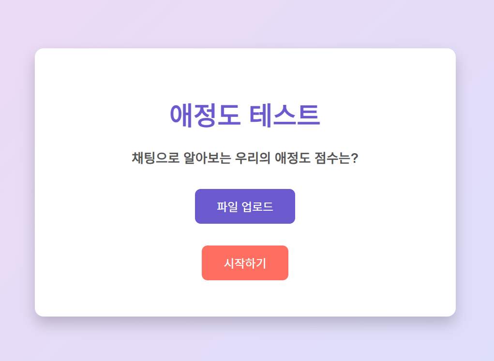
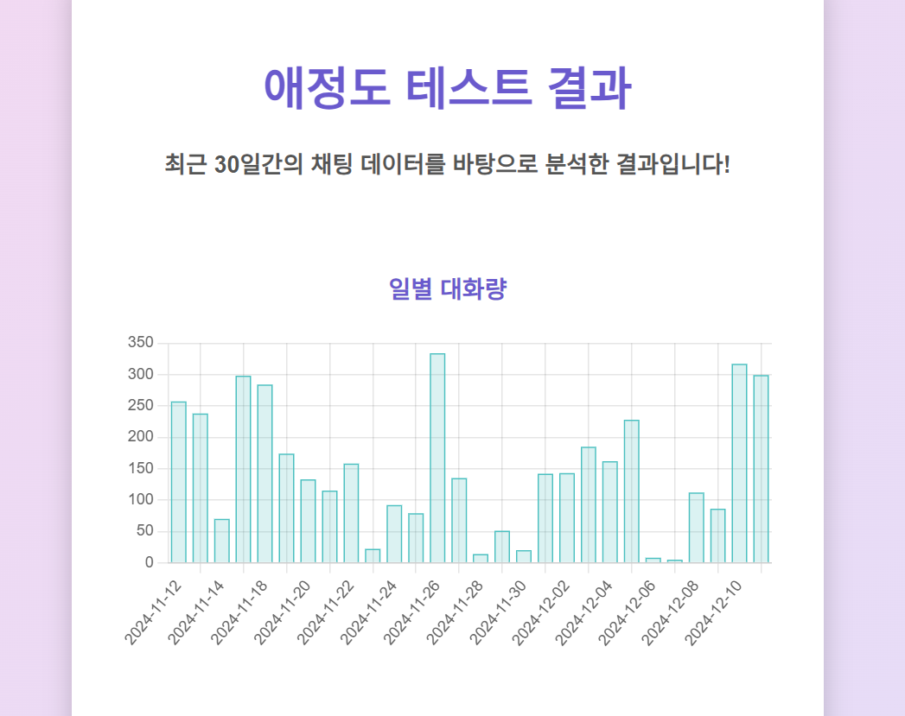
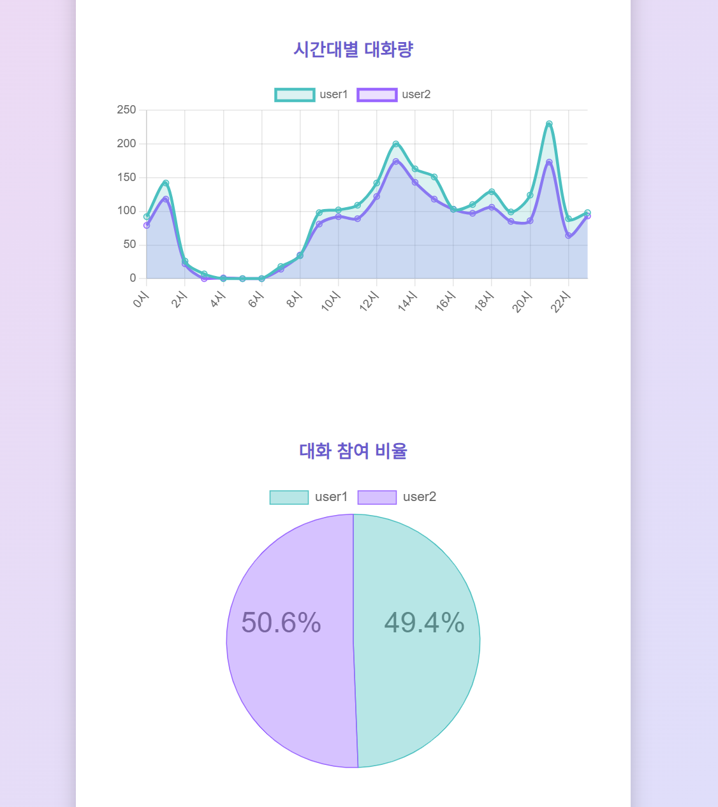
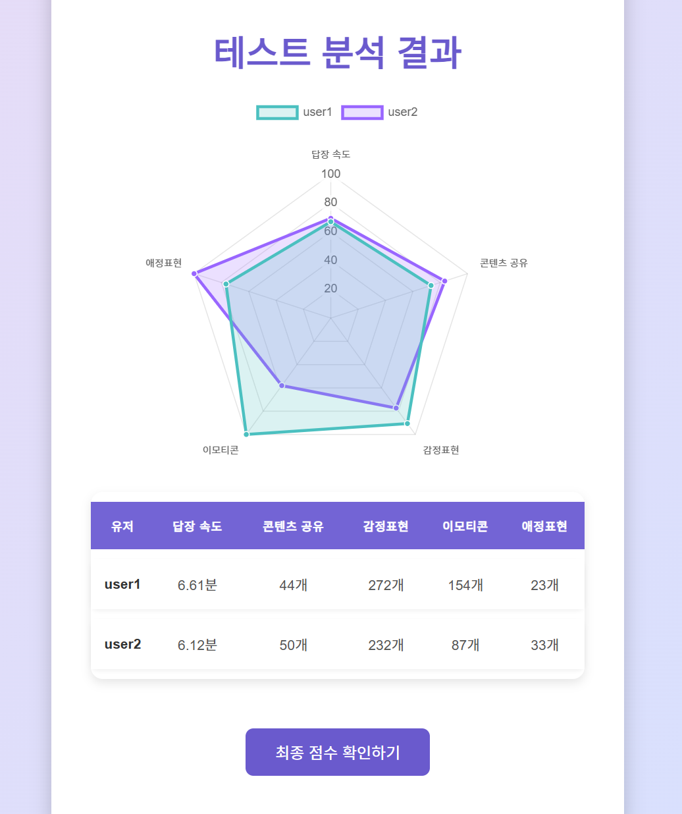
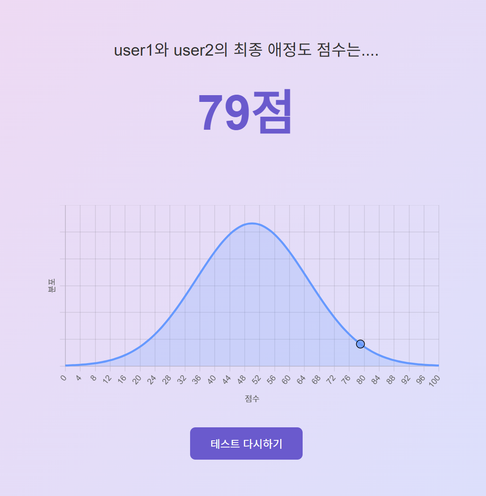

# 💖 애정도 테스트 애플리케이션

## 📋 프로젝트 개요
이 애플리케이션은 **카카오톡 대화 데이터를 분석**하여 두 사람 간의 애정도를 점수로 계산하고 시각적으로 표현해주는 재미있는 웹 애플리케이션입니다. 정규분포 그래프와 다양한 시각적 도구를 사용하여, 대화 패턴과 감정 표현의 데이터를 기반으로 **애정도 점수**를 계산합니다.

---

## 🛠️ 주요 기능
### 1. **카카오톡 대화 분석**
- 사용자가 업로드한 카카오톡 대화 파일을 분석합니다.
- 최근 30일간의 대화 데이터를 기준으로 애정도 점수를 계산합니다.

### 2. **다양한 점수 기준**
- **답장 속도**: 평균 답장 시간을 분석하여 점수화.
- **콘텐츠 공유**: 사진, 동영상, 파일 공유 횟수를 기준으로 점수화.
- **감정 표현**: `ㅎㅎ`, `ㅋㅋ` 같은 웃음 표현 횟수를 분석.
- **이모티콘 사용**: 대화 중 사용된 이모티콘 빈도를 계산.
- **애정 표현**: '사랑', '좋아'와 같은 애정 표현을 바탕으로 점수를 부여.

### 3. **시각화**
- **정규분포 그래프**: 애정도 점수가 정규분포에서 어느 위치에 있는지 시각적으로 표현.
- **일별 대화량 차트**: 최근 30일 동안의 대화량 추세를 그래프로 표시.
- **시간대별 대화량 차트**: 하루 중 대화가 활발했던 시간대를 시각적으로 보여줌.
- **대화량 비율**: 두 사람의 대화 기여도를 파이 차트로 표현.

### 4. **결과 요약**
- 두 사람의 평균 애정도 점수를 계산하여 결과를 한눈에 확인할 수 있습니다.
- 최종 애정도 점수를 기반으로 결과를 재밌게 시각화합니다.

---
## 📂 카카오톡 대화 로그 파일 불러오기

애플리케이션은 **카카오톡 대화 파일**을 텍스트 형식으로 분석합니다. 다음 단계를 따라 대화 로그 파일을 추출하세요.

### 1. 카카오톡 대화 파일 내보내기
1. 카카오톡 앱에서 원하는 채팅방을 엽니다.
2. 우측 상단의 **옵션(≡)** 버튼을 클릭합니다.
3. **채팅방 설정** > **내보내기**를 선택합니다.
4. **텍스트만 내보내기**를 선택합니다.
5. 대화 파일이 생성됩니다.

---

## 📂 파일 구조
```plaintext
📁 프로젝트 루트
├── app.py             # Flask 애플리케이션 메인 파일
├── templates/         
│   ├── index.html     # 메인 업로드 페이지
│   ├── result.html    # 결과 페이지
│   ├── final_score.html # 최종 점수 페이지
├── static/            
│   ├── css/
│   │   ├── style.css  # 공통 스타일 시트
│   ├── js/
│       ├── script.js  # 클라이언트 측 스크립트
├── assets/            
│   ├── main-page.png  
│   ├── result1.png    
│   ├── result2.png    
│   ├── result3.png    
│   ├── final-score.png    
└── README.md          
```
## 🎨 실행 화면
### **1. 메인 페이지**
- 카카오톡 대화 파일 업로드와 시작하기 버튼 제공.
  


### **2. 분석 결과**
- 일별 대화량, 시간대별 대화량, 대화 비율, 점수 그래프 등을 시각적으로 확인 가능.
  






### **3. 최종 점수**
- 정규분포 그래프와 함께 두 사람의 최종 점수를 제공.


---

## 📊 점수 계산 기준

| 항목              | 기준                                          |
|-------------------|---------------------------------------------|
| **답장 속도**       | 평균 답장 시간이 20분 이하일수록 높은 점수 부여. |
| **콘텐츠 공유**     | 사진, 동영상 등을 공유한 횟수 분석.           |
| **감정 표현**       | `ㅋㅋ`, `ㅎㅎ` 등 웃음 표현의 빈도 분석.       |
| **이모티콘 사용**   | 대화 중 사용된 이모티콘의 빈도 분석.           |
| **애정 표현**       | `사랑`, `좋아` 등 긍정적인 키워드 사용 횟수 분석.|

---


